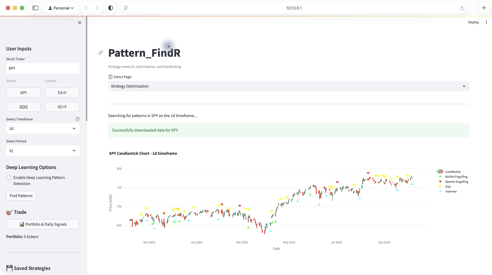
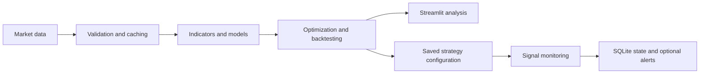

# Pattern_FindR

[](https://github.com/jnaggud/pattern_findr/actions/workflows/tests.yml)

**An interactive research workbench for systematic trading strategies.**

Pattern_FindR brings market-data preparation, technical indicators, machine-learning experiments, parameter search, and backtesting into a Python application. Its Streamlit interface makes it possible to explore a strategy, inspect individual trades, and compare results with a buy-and-hold baseline.

The repository also includes a modular signal-monitoring system with SQLite state storage, market-session handling, and optional Discord notifications.



*The research dashboard running in Safari with one year of SPY daily data. Pattern markers illustrate the analysis interface; they are not a performance claim.*

## What it demonstrates

- **Data engineering:** historical OHLCV ingestion, local caching, data validation, and incremental storage.
- **Quantitative research:** indicator combinations, composite oscillators, Optuna parameter search, and walk-forward evaluation scripts.
- **Machine learning:** scikit-learn and XGBoost experiments, plus a TensorFlow workflow for chart-pattern classification.
- **Interactive analysis:** Plotly price charts, trade logs, equity curves, and configurable backtests in Streamlit.
- **Application engineering:** modular position management, SQLite transactions, retry handling, and automated tests.

## Architecture



| Area | Main entry points |
| --- | --- |
| Research dashboard | `app.py`, `oscillator_predictor_page.py` |
| Indicators and optimization | `indicators.py`, `novel_indicators.py`, `optimization.py`, `optuna_worker.py` |
| Backtesting and validation | `backtester.py`, `velocity_walkforward_validation.py` |
| Signal monitoring | [`velocity_trading/`](velocity_trading/README.md) |
| Automated checks | [`tests/`](tests) |

## Quick start

Use **Python 3.10**. The setup is intended for a local research environment; Apple Silicon macOS is the primary development platform.

```bash
git clone https://github.com/jnaggud/pattern_findr.git
cd pattern_findr
python3.10 -m venv .venv
source .venv/bin/activate
python -m pip install -r requirements.txt
./run_app_conda.sh
```

The launcher uses the active Python environment and serves the dashboard at **http://localhost:8501**. Despite its historical filename, it works with either an activated virtual environment or Conda environment. Open that address in Safari on macOS.

For Conda, create and activate a Python 3.10 environment first, then use the same installation command. See the [setup guide](REQUIREMENTS_README.md) for dependency and optional-feature details.

### First research session

1. Open **Strategy Optimization** and select a ticker and daily data interval.
2. Start with a small trial count to confirm that data loading and backtesting work.
3. Inspect trade timestamps, drawdown, and the benchmark comparison alongside total return.
4. Save a candidate strategy and evaluate it on a separate time period before drawing conclusions.

Data availability depends on the provider. Trained model weights are **not included**. Chart-pattern inference requires locally trained models; the application provides training controls. The checked-in `chart_images/` assets use Git LFS and are retained for the training workflow. Run `git lfs pull` if you need those assets.

## Configuration

The basic dashboard can use yfinance without a paid data-provider key. Optional integrations use local configuration:

```bash
cp .env.example .env
# Add only the credentials needed for the features you use.
```

The dashboard loads `.env` when available. For command-line tools, export the variables in your shell before running them. Keys and webhook URLs must stay out of committed strategy files. See [configuration notes](docs/configuration.md).

## Tests

```bash
python -m pip install -r requirements-test.txt
python -m pytest tests -q
```

GitHub Actions runs the full suite on Python 3.10. The tests cover position transitions, timestamp handling, market sessions, retry behavior, data loading, and dashboard chart rendering. Integration, regression, and stress tests are included under `tests/`. Root-level research scripts named `test_*.py` are separate experiments and may fetch external data.

## Research scope and limitations

- Backtest returns are historical simulations. Results depend on data quality, signal timing, execution assumptions, and transaction-cost settings.
- Optimization can overfit. Walk-forward and held-out evaluation should be part of any research workflow.
- Optional research pages may require additional packages and locally trained artifacts; they are not all covered by the core unit suite.
- Signal monitoring and brokerage order execution are separate concerns. Review any execution bridge before connecting it to an account.
- The main application currently configures TensorFlow for CPU execution.

This project is for research and education and does not provide investment advice or guarantee trading performance.

## Documentation

- [Documentation index](docs/README.md)
- [Installation and dependencies](REQUIREMENTS_README.md)
- [Dashboard user guide](USER_GUIDE.md)
- [Velocity Trading package](velocity_trading/README.md)
- [Contributing](CONTRIBUTING.md)

Questions and reproducible bug reports are welcome through [GitHub Issues](https://github.com/jnaggud/pattern_findr/issues).

## License

Project code is available under the [MIT License](LICENSE). The bundled pandas-ta code retains its own [third-party notice](THIRD_PARTY_NOTICES.md).
